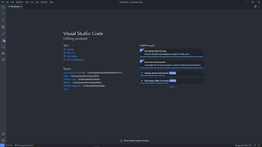
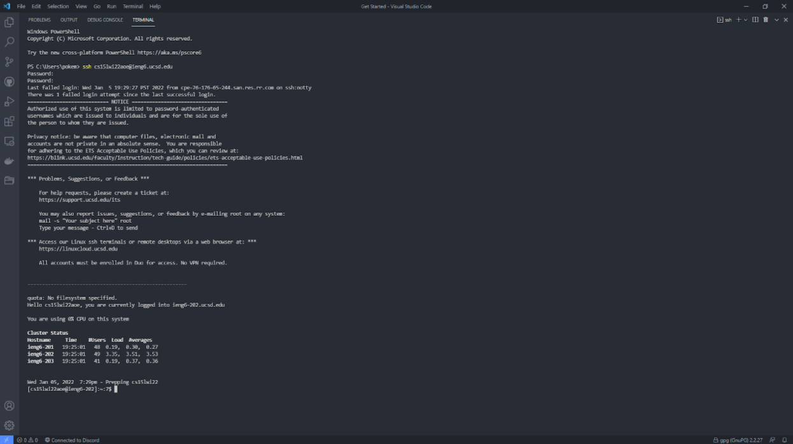
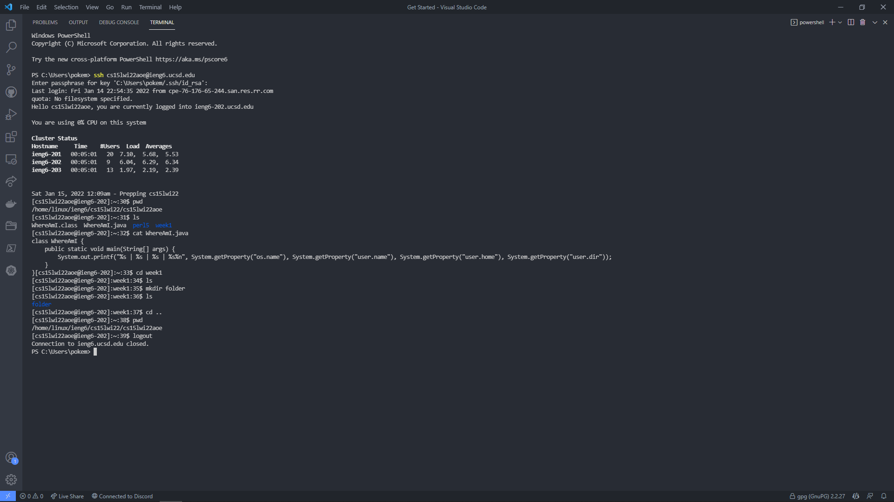
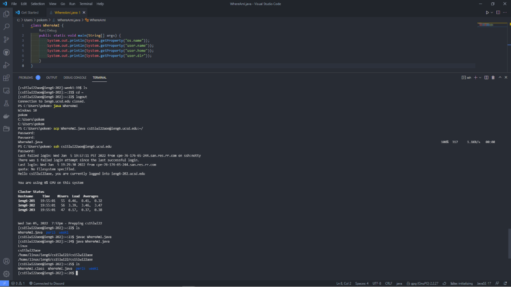
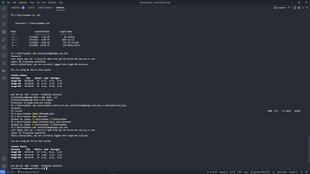
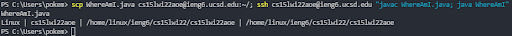

# Lab Report 1 (Week 2)

**Hello future CSE 15L student!**

Are you excited to take this class? Just bursting at the seams? But your anticipation is ruined because the class requires you to SSH into a remote server? *SSH?* What even is that?

Well, struggle no longer, friend! For this guide is here for you!  For 15L students, *by* 15L students.

**SSH** stands for **S**ecure **Sh**ell Protocol, a *protocol* to run a remote *shell* securely. What's a shell and why is it remote? A shell is like that terminal or command prompt that you write commands in, and probably what you think of when you think of hackers. And when you want to do something over a network, like talk to a computer or a server, you might want to do that without said hackers or any unauthorized persons listening in.

And that's why you should download [NordVPN](https://www.youtube.com/watch?v=iik25wqIuFo) today!

Just kidding. What you *should* do is follow this tutorial. I'll be using Visual Studio Code [(VSCode)](https://code.visualstudio.com/) for this demonstration, although you can use any shell, terminal, or command prompt available to you at this time.

## Visual Studio Code



## Remote Connecting

By now you should have a course-specific account on `ieng6` for CSE 15L. It's something along the line of `cse15l{quarter}{year}{random letters}@ieng6.ucsd.edu`. Check the [account lookup tool](https://sdacs.ucsd.edu/~icc/index.php) for the username of your account.

> *Note:* If you are using Windows, like me, you should install [OpenSSH](https://docs.microsoft.com/en-us/windows-server/administration/openssh/openssh_install_firstuse) first.

In the terminal, run the command as follows: `ssh cs15l{your account}@ieng6.ucsd.edu`. It will likely prompt you for your password, which should be the same as your Active Directory SSO password. Don't be alarmed if you don't see anything when you type in your password; it's actually hidden from you.

```shell
$ ssh {YOUR CSE 15L IENG6 ACCOUNT HERE}
Password:
The authenticity of host 'ieng6.ucsd.edu (128.54.70.227)' can't be established.
RSA key fingerprint is SHA256:ksruYwhnYH+sySHnHAtLUHngrPEyZTDl/1x99wUQcec.
Are you sure you want to continue connecting (yes/no/[fingerprint])? 
```

> *Note:* If this is your first time connecting to this server, say yes. If this is not your first time connecting to that server, then it is possible that the server has been spoofed by someone trying to listen on you. Pesky hackers.

The prefix in your prompt should now look like the following:

```shell
[cs15l{your account here}@ieng6.ucsd.edu]:~:1$ 
```

Your account is enclosed in square brackets, followed by a colon, the directory you're in (currently the root directory `~`), and the number of commands you've run thus far.



## Unix Commands

Let's try out a few terminal commands while we're here.

- `ls` - list files
- `pwd` - print working directory
- `cd {directory}` - change to directory
- `mkdir {directory}` - make directory
- `cat {file}` - concatenate files, print to standard output
- `cp {file} {directory}` - copy file to given directory
- `exit`, `logout` (Ctrl+D) - logout of SSH server

> *Note:* run `man {command}` to print out the documentation for the commands above if you need help or just curious.



## Moving Files from Client to Server

Now that's cool and all, but why would we ever want to do this? Well, perhaps you're like me, a Windows user who is wondering if their program runs on other operating systems such as Linux. Remote accessing a computer with Linux is a great way to test your environment. In addition, SSH is also an industry standard where company code is being worked on, so learning SSH is a necessity.

I wrote the following code to clearly outline the difference between the *client* (my computer) and the *server* (the computer I am remote accessing).

```java
class WhereAmI {
  public static void main(String[] args) {
    System.out.println(System.getProperty("os.name"));
    System.out.println(System.getProperty("user.name"));
    System.out.println(System.getProperty("user.home"));
    System.out.println(System.getProperty("user.dir"));
  }
}
```

Run `javac WhereAmI.java` and then `java WhereAmI` on your own system. It will print out your system information, if working correctly.

Now run `scp {files} {SSH account}:~/`. It has almost the same functionality as `cp`, which copies files to a given directory, but has SSH functionality. If you're especially astute, you may notice that we are copying to the root folder `~`. Once it finishes copying, it will automatically log back out of the server. Thus, we log back in, and run `javac WhereAmI.java` and `java WhereAmI` to print out the system information of the server. Most likely, it is different from what was printed out for the client.



## SSH Keys

Have you noticed how every time you interact with SSH, you need to type in your password every time? That starts to get annoying fast, even though it is very secure.

If you so prefer, you can indulge in a life hack called *ssh keys*. Essentially, by running a program called [`ssh-keygen`](https://en.wikipedia.org/wiki/Ssh-keygen), you create a pair of keys - one public, one private. The public is copied to the server (using `scp`), and the private key is stored in a secret place on the client. After setting it up, you can use the `ssh` command with these two files to authenticate to the server instead of using your password.

> *Note:* Windows users please consult [`ssh-add`](https://docs.microsoft.com/en-us/windows-server/administration/openssh/openssh_keymanagement#user-key-generation).

When setting up, you can press the enter key to send an empty input, which defaults to the value in the parentheses.

```shell
# on the client (your computer)
$ ssh-keygen
Generating public/private rsa key pair.
Enter file in which to save the key (/Users/{you}/.ssh/id_rsa): 
Enter passphrase (empty for no passphrase): 
Enter same passphrase again: 
Your identification has been saved in /Users/{you}/.ssh/id_rsa.
Your public key has been saved in /Users/{you}/.ssh/id_rsa.pub.
The key fingerprint is:
SHA256:mHqSTLqfL+DfGfBylfv4RX9flYgnRDPW6RBvBp1rmQU {you}@{your computer's name}
The key's randomart image is:
+---[RSA 3072]----+
|           B+E+  |
|          o.== . |
|           .o+=  |
|       o .. +*. .|
|    o o S  ooo ..|
|  .+ = . . .o.  .|
| ...* = .   . . o|
|  ...B o o .   .o|
|  .o+o+ ..o     .|
+----[SHA256]-----+
```



## Timesavers and Tips

On the topic of life hacks for CSE 15L, since you will be using the command line frequently:

- You can run terminal commands on the remote server on your client with one line by enclosing your command in quotes.
  - The command will be run on the remote server, then will exit the connection from the remote server.
  - If you didn't set an SSH key like stated previously, you will need to enter your password.
  - In order to prevent being logged out, add the command `exec bash` to the end of your command (see below for how to run multiple commands at once) and use the `-t` flag to run the shell program on the remote server.
- In order to run multiple commands in the same line, use a semicolon `;` to delineate separate commands.
- Use the up and down arrows to navigate through previous commands.



> Pictured: An example one-liner copying `WhereAmI.java` to the remote server using `scp`, then compiling and running it on the remote server before logging out.

__Without optimizations:__ *111* keystrokes for *four* separate commands and entering your password in twice (which is even *more* keystrokes) each time the command is run.

```shell
$ scp WhereAmI.java cs15lwi22aoe@ieng6.ucsd.edu:~/
Password:
WhereAmI.java
...

$ ssh cs15lwi22aoe@ieng6.ucsd.edu
Password:
...

[cs15lwi22aoe@ieng6.ucsd.edu]:~:1$ javac WhereAmI.java
[cs15lwi22aoe@ieng6.ucsd.edu]:~:2$ java WhereAmI
Linus | cs15lwi22aoe | /home/linux/ieng6/cs15lwi22/cs15lwi22aoe | /home/linux/ieng6/cs15lwi22aoe
```

__Optimized:__ 118 keystrokes for a one-line command without having to enter your password. After you've done it once, you can use the up-arrow *1 time* to get the previous command, thus saving time in the long run. It also gives you an immediate response after  this command, instead of having to set the files and server up every single time.

```shell
$ scp WhereAmI.java cs15lwi22aoe@ieng6.ucsd.edu:~/; ssh cs15lwi22aoe@ieng6.ucsd.edu "javac WhereAmI.java; java WhereAmI"
WhereAmI.java
Linux | cs15lwi22aoe | /home/linux/ieng6/cs15lwi22/cs15lwi22aoe | /home/linux/ieng6/cs15lwi22aoe
```

***GO GET 'EM CHAMP!***

[](https://www.youtube.com/watch?v=iik25wqIuFo)
