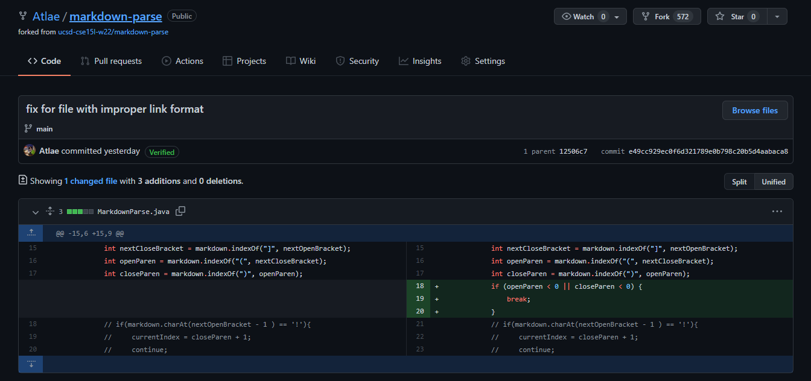

# Lab Report 2 (Week 4)

Don't you just hate it when there are bugs in your code? 🐛🐜🦋🕷🦟 It may not be the most enjoyable thing in your day, but it beats having bugs in your soup. I love it when I can see the bugs in my code and fix them. I also love soup. 

Here are three bugs I encountered in my latest project for CSE 15L, a [markdown parser](https://github.com/Atlae/markdown-parse) intended to grab the links given a markdown file. This is a rudimentary form of scraping, although it has a slightly different purpose in that it is given a markdown file instead of a web page, so it can be done without an internet connection. Other approaches could have used the Python library [BeautifulSoup](https://www.crummy.com/software/BeautifulSoup/bs4/doc/) (all this thought of soup makes me hungry), or dreaded regex.

## Bug 1 🐛


### Failure-inducing input

Images incorrectly identified as links with [test-file2.md](https://github.com/Atlae/markdown-parse/blob/main/test-file2.md):

```md
# Header 

[link](something.in)
```

### Symptom/Output

```sh
$ javac MarkdownParse.java
$ java MarkdownParse test-file2.md
[image1.png, something.in]
```

### Reason

The image is incorrectly identified as a link because we were looking for opening and closing brackets, both square and circular. However, images in Markdown share close to the same syntax as links, so we need to look for the exclamation mark that identifies them. That way, we can exclude images from being identified as links.

## Bug 2 🐜



### Failure-inducing input

Improperly formatted links (missing opening or closing parentheses) with [test-file4.md](https://github.com/Atlae/markdown-parse/blob/main/test-file4.md):

```md
[15l link]https://ucsd-cse15l-w22.github.io/
```

### Symptom/Output

```sh
$ javac MarkdownParse.java
$ java MarkdownParse test-file4.md
Exception in thread "main" java.lang.StringIndexOutOfBoundsException: begin 0, end -1, length 44
        at java.base/java.lang.String.checkBoundsBeginEnd(String.java:4601)
        at java.base/java.lang.String.substring(String.java:2704)
        at MarkdownParse.getLinks(MarkdownParse.java:25)
        at MarkdownParse.main(MarkdownParse.java:33)
```

### Reason

MarkdownParse utilizes a `while` loop to find the index of the opening and closing parentheses. However, the opening and closing parentheses are not found, because they don't exist, so `openParen` and `closeParen` are set to -1. On line 25, however, we call `substring` on the string `link` to get the substring between the parentheses. Since the indices we pass are negative, we get an exception.

## Bug 3 🦋


### Failure-inducing input

Markdown file starts with an open square bracket with [test-file3.md](https://github.com/Atlae/markdown-parse/blob/main/test-file3.md):

```md
[15l link](https://ucsd-cse15l-w22.github.io/)
[another link!](some-page.html)
```

### Symptom/Output

```sh
$ javac MarkdownParse.java
$ java MarkdownParse test-file3.md
Exception in thread "main" java.lang.StringIndexOutOfBoundsException: String index out of range: -1
        at java.base/java.lang.StringLatin1.charAt(StringLatin1.java:48)
        at java.base/java.lang.String.charAt(String.java:1512)
        at MarkdownParse.getLinks(MarkdownParse.java:21)
        at MarkdownParse.main(MarkdownParse.java:33)
```

### Reason

In order to check for the exclamation mark in [Bug #1 🐛](https://github.com/Atlae/cse15l-lab-reports/blob/main/lab-report-2-week-4.md#bug-1), we look at the index prior to the opening square bracket. However, the index is negative because the first occurrence is at index 0, so we get an exception. Thus, we put a guard condition to make sure the index is not zero.

### Conclusions

Debugging isn't so bad! And I realized that bugs are an important part of the ecosystem, and help you become a better programmer. Also eating bugs might be in the future. Bug soup, mmm. 
