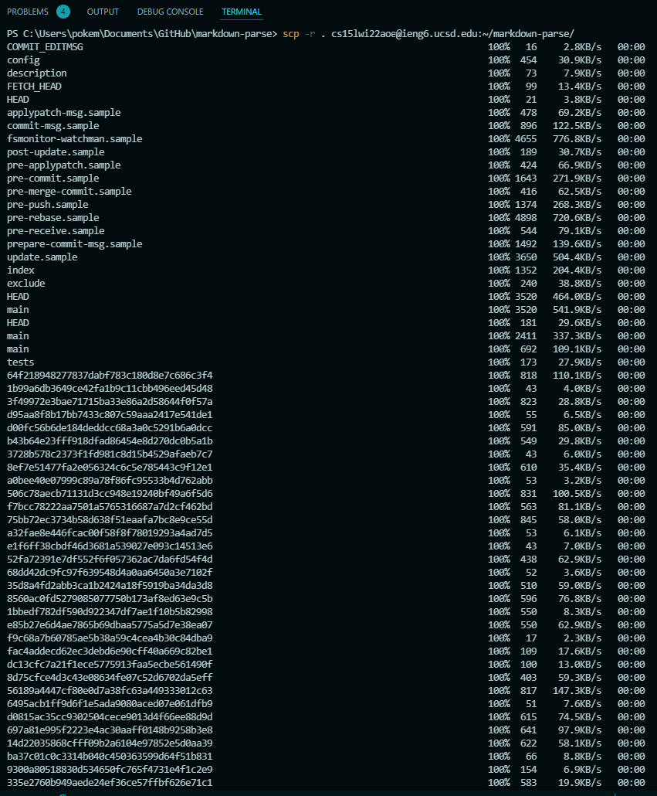

# Lab Report 3 (Week 6)

Hello there! Today we are going to be copying whole directories to a remote server with `scp -r`. In the process, we will be optimizing certain aspects of our workflow.

## Streamlining SSH Configuration

To easily log into the SSH server, we will be using a configuration file to refer to the SSH keys. This file will be stored in the `.ssh` directory in our home directory.

The basic format of this file is as follows:

```txt
Host *
  User username
  Hostname hostname.com
  IdentityFile ~/.ssh/id_rsa
```

The *Host* refers to the section of the file that contains the information for a specific host. The *User* refers to the username that we will be using to log into the host. The *Hostname* refers to the hostname of the host we are connecting to. The *IdentityFile* refers to the location of the SSH key that we will be using to log into the host.

After setting up the config file, if you run the command `ssh {host}` you will be prompted for your password (unless you set up [passwordless access](https://atlae.github.io/cse15l-lab-reports/lab-report-1-week-2.html)).


## Setup GitHub Access from ieng6

In our workflow, we want to be able to clone and pull from the repository on the remote server. We will be using the `git` command to do this. However, we need to authenticate with GitHub to do this, and this requires a [token-based login](https://docs.github.com/en/authentication/connecting-to-github-with-ssh/adding-a-new-ssh-key-to-your-github-account).

The location of my GitHub token is in the `~/.ssh/github_token` file on the ieng6 server.


My public key on GitHub:


My commit with the token (the token has been censored):


The commit reflected on GitHub:

[Commit](https://github.com/Atlae/markdown-parse/commit/8e9c28d033f6e877b6fcc6f6f19fc81f3df55f42)

## Copy whole directories with `scp -r`

Here's the task that we originally meant to do that we've been building up to. We want to be able to run the [markdown-parse](https://github.com/Atlae/markdown-parse) repository on the ieng6 server.

First, we copy the whole directory to the server. Notice that the `-r` flag is used to copy the whole directory *recursively*, and that includes many of the Git objects.



Next, we run the tests on the server. We will be using the `make test` command after using our newly streamlined SSH process to login.


Of course, we want to do this in one line, because we're cool like that. B)


