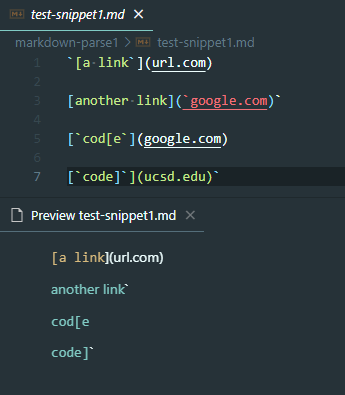
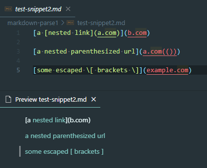
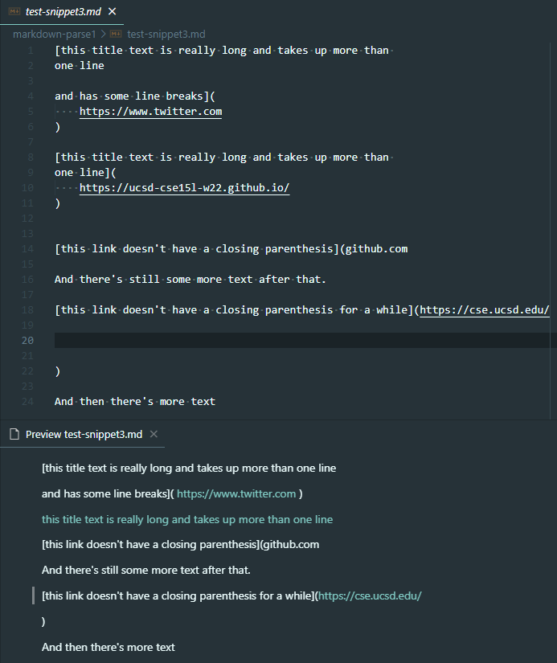
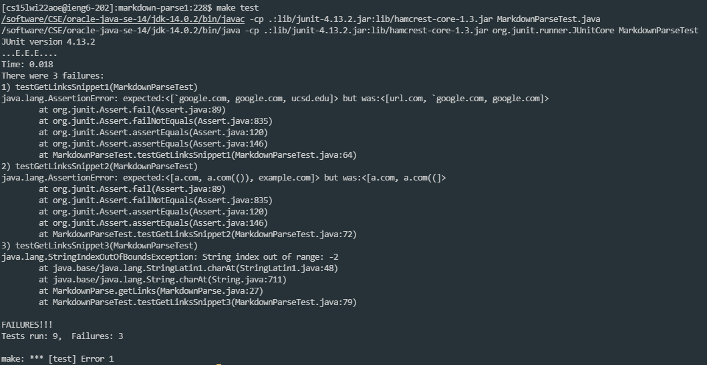
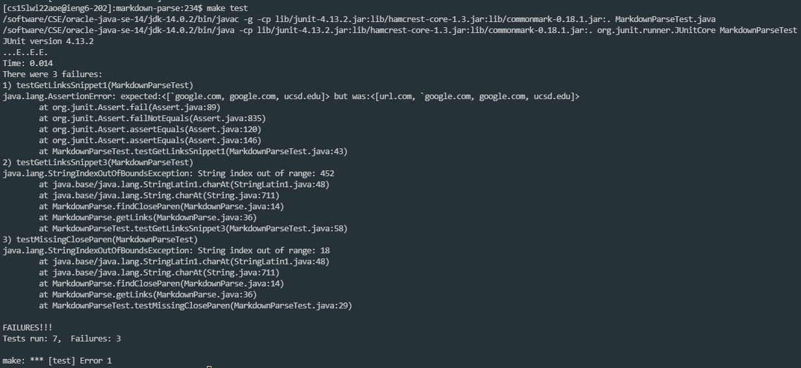

# Lab Report 4 (Week 8)

## New Test Snippets and their Results





## What to add to `MarkdownParseTest.java`

```java
 @Test
 public void testGetLinksSnippet1() throws IOException {
     Path fileName = Path.of("test-snippet1.md");
     String contents = Files.readString(fileName);
     ArrayList<String> links = MarkdownParse.getLinks(contents);
     assertEquals(List.of("`google.com", "google.com", "ucsd.edu"), links);
 }

 @Test
 public void testGetLinksSnippet2() throws IOException {
     Path fileName = Path.of("test-snippet2.md");
     String contents = Files.readString(fileName);
     ArrayList<String> links = MarkdownParse.getLinks(contents);
     assertEquals(List.of("a.com", "a.com(())", "example.com"), links);
 }

 @Test
 public void testGetLinksSnippet3() throws IOException {
     Path fileName = Path.of("test-snippet3.md");
     String contents = Files.readString(fileName);
     ArrayList<String> links = MarkdownParse.getLinks(contents);
     assertEquals(List.of("https://ucsd-cse15l-w22.github.io/"), links);
 }
```

## [My Implementation and Test Results](https://github.com/Atlae/markdown-parse)



## [Their Implementation and Test Results](https://github.com/ucsd-cse15l-w22/markdown-parse)



## Questions

**Do you think there is a small (<10 lines) code change that will make your program work for snippet 1 and all related cases that use inline code with backticks? If yes, describe the code change. If not, describe why it would be a more involved change.**

I believe that a small change could easily be made by tracking the positions of the backticks. This would allow the program to know where the start and end of the code block is. In the case that the backticks are after the text/are cut off, the links will render normally.

**Do you think there is a small (<10 lines) code change that will make your program work for snippet 2 and all related cases that nest parentheses, brackets, and escaped brackets? If yes, describe the code change. If not, describe why it would be a more involved change.**

I think the change would be slightly more involved for this. In the case of `a.com(())`, the program would need to know to search for two closing parentheses before closing the link. This would require a bit more work to implement as well as needing to know when to actually search for `a.com((`.

**Do you think there is a small (<10 lines) code change that will make your program work for snippet 3 and all related cases that have newlines in brackets and parentheses? If yes, describe the code change. If not, describe why it would be a more involved change.**

I think a simple change could be made. The root of the problem is that the program isn't accustomed to having text or newlines after the last link, thus causing the index of `nextOpenBracket` to be -1 and cause problems. I think adding an if statement for this situation could easily solve this problem.
