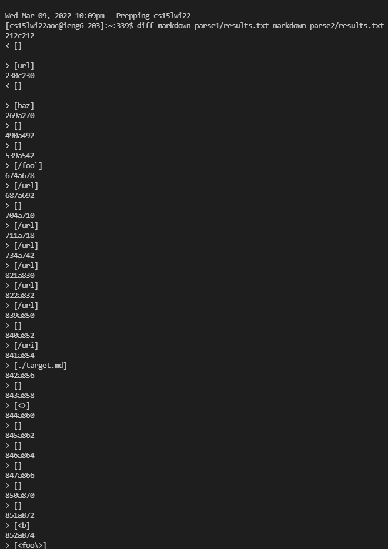
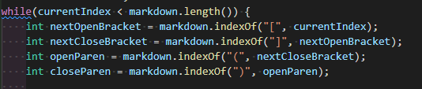
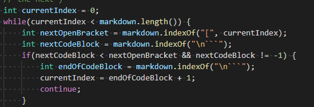

# Lab Report 5 (Week 10)

For each implementation, I redirected the output to a text file `results.txt` and then used the `diff` command to compare the results. The results were different in a few ways.



## Test File 342

### Contents of 342.md

```md
[not a `link](/foo`)
```

### Their Implementation Output

```text
test-files/342.md
[/foo`]
```

### My Implementation Output

```text
test-files/342.md
Exception in thread "main" java.lang.StringIndexOutOfBoundsException: String index out of range: -2
        at java.base/java.lang.StringLatin1.charAt(StringLatin1.java:48)
        at java.base/java.lang.String.charAt(String.java:711)
        at MarkdownParse.getLinks(MarkdownParse.java:27)
        at MarkdownParse.main(MarkdownParse.java:41)
```

Neither of the implementations were able to parse the file correctly; the expected output is empty because of the presence of two backticks representing a code block.

Their implementation could be fixed if there was a way to keep track of the backticks. My implementation had a StringIndexOutOfBoundsException which needs a different, more fundamental fix.

#### The code that could be changed



### What 342.md should look like

[not a `link](/foo`)

## Test File 201

### Contents of 201.md

```md
[foo]: <bar>(baz)

[foo]
```

### Their Implementation Output

```text
test-files/201.md
[baz]
```

### My Implementation Output

```text
test-files/201.md
[]
```

My implementation was able to parse the file correctly; the expected output was empty because the link was not properly formatted.

Their implementation failed to account for the space in between the closing bracket `]` and the opening parenthesis `(`. Searching for the sequence `](` may be a better fix.

#### The code that could be changed



### What 201.md should look like

[foo]: <bar>(baz)

[foo]

(On GitHub and in VSCode Preview the markdown is not rendering, which is what I used in my explanation. However, on the website, it links to `<bar>(baz)`, which is a whole different thing altogether that I did not discuss, which I assume at this time to be the way that markdown is transpiled into HTML and rendered. For the sake of simplicity I will consider this an unintended behavior.)

```html
<p>
    <a href="<bar>(baz)">foo</a>
</p>
```
